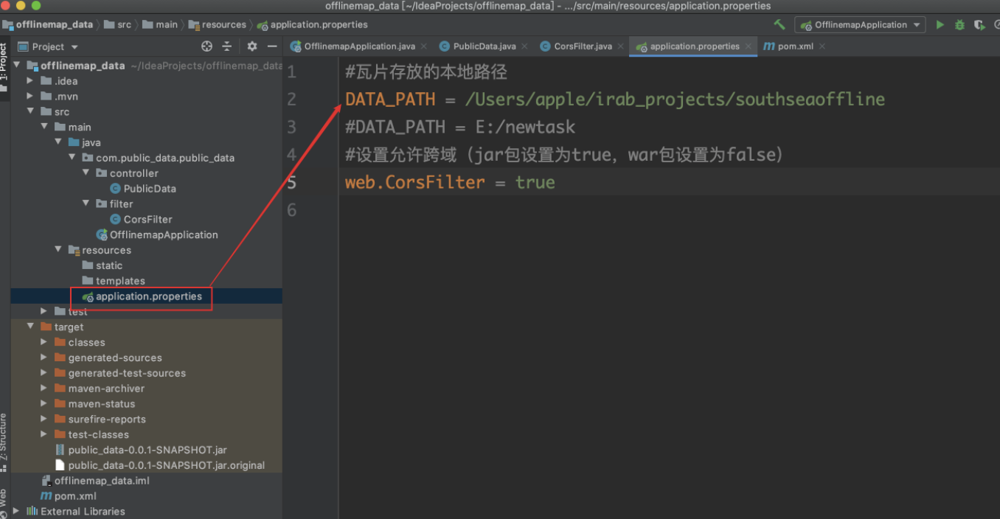
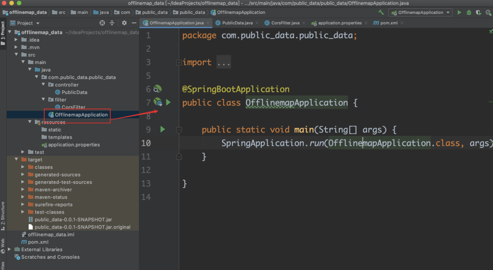

# Readme

1. 地图的瓦片读取加载在如下位置：


2. 后端可以采用Springboot，分为Springboot服务和瓦片地图两种方式，将瓦片地图（roadmap文件）存放在电脑上某个路径下下，并把此路径替换Springboot中的application.properties--DATA_PATH

   

   点击OfflinemapApplication并运行服务即可 默认启动8080端口 ，（后面也可以直接打jar包，终端运行也可以）：

   

3. 前端offline-React-leaflet：cd到文件下：
   * 安装依赖项：```yarn install```
   * 运行项目：```yarn start```